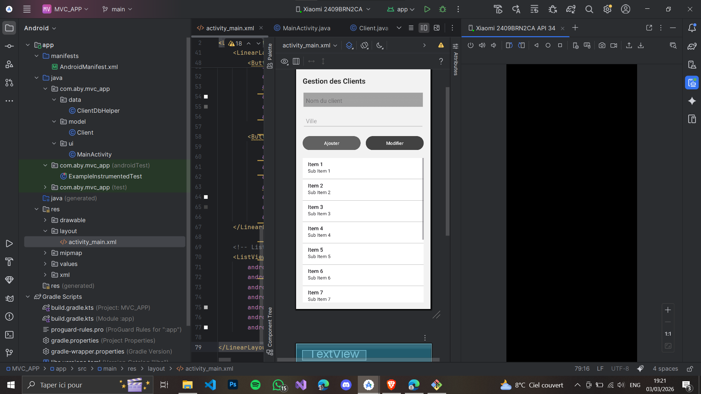
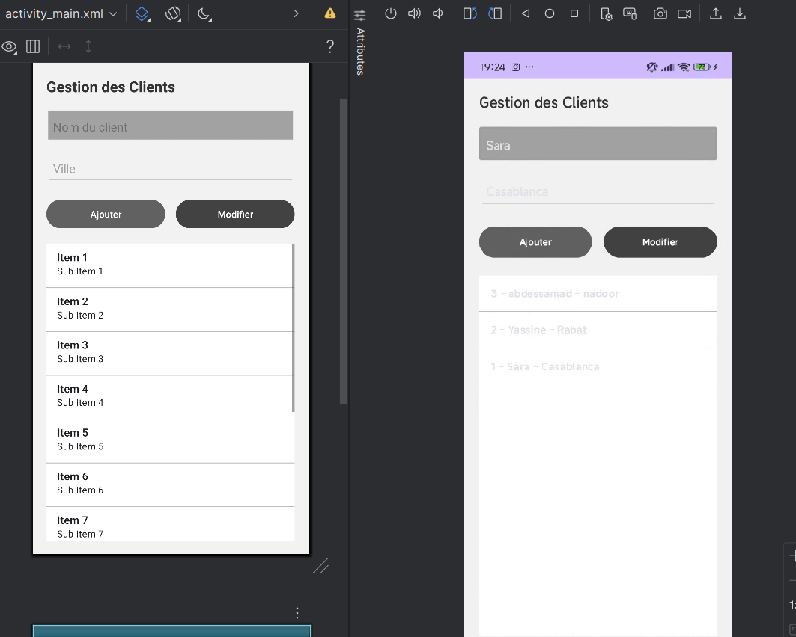

### Client Management App – MVC Architecture (Android – Java)

Client Management App is a lightweight Android application built with Java that demonstrates the Model–View–Controller (MVC) architectural pattern using a local SQLite database.

This project is intended for students learning Android architecture fundamentals before transitioning to MVVM.

### Project Overview

This is a simple CRUD (Create, Read, Update, Delete) application that allows users to:

Add clients

Update clients

Delete clients

Display all stored clients

The main objective of this project is to demonstrate:

Clear separation of concerns

Clean and structured Java code

Proper package organization

SQLite database integration

Traditional Android MVC implementation (without ViewModel or LiveData)

In this implementation, the Activity acts as both the View and the Controller, while all database logic is isolated in the Model layer.

### Architecture – MVC Pattern
```
MVC_APP/
├── model/
│   └── Client.java
├── data/
│   └── ClientDbHelper.java
├── ui/
│   └── MainActivity.java
└── res/layout/
    └── activity_main.xml
```

### Technologies Used

Java

Android SDK

SQLite

SQLiteOpenHelper

ListView

ArrayAdapter

### Project Structure
```
MVC_APP/
├── app/
│   └── src/
│       └── main/
│           ├── java/
│           │   └── com/example/mvc_app/
│           │       ├── model/
│           │       │   └── Client.java
│           │       ├── data/
│           │       │   └── ClientDbHelper.java
│           │       └── ui/
│           │           └── MainActivity.java
│           └── res/
│               └── layout/
│                   └── activity_main.xml
├── screenshots/
├── README.md
└── LICENSE
```
### Screenshot
<div align="center">
  
</div> <br>
<div align="center">
  
</div>

### Installation
1. Clone the Repository
```
git clone https://github.com/abdessamad-erramy/Gestion-des-Clients-MVC-.git
```
```
cd Gestion-des-Clients-MVC-
```
2. Open in Android Studio
   
Launch Android Studio

Click Open

Select the MVC_APP folder

Wait for Gradle synchronization

### 3. Build the Project

If necessary:

Build → Rebuild Project

Running the Application

Start an Android Emulator
or

Connect a physical Android device

Click Run in Android Studio.
The application will launch automatically.

### How to Use

Enter the client name.

Enter the city.

Click Add to insert a new client.

Tap a client to load its information into the input fields.

Modify the data and click Update.

Long press on a client to delete it.

The ListView refreshes automatically after each action.

Educational Purpose

This project helps students:

Understand classical MVC architecture in Android

Practice SQLite database integration

Learn proper separation of concerns

Prepare for transitioning to MVVM architecture

Future Improvements

Replace ListView with RecyclerView

Add input validation

Implement search functionality

Add dark mode support

Migrate to MVVM architecture

Add unit testing
